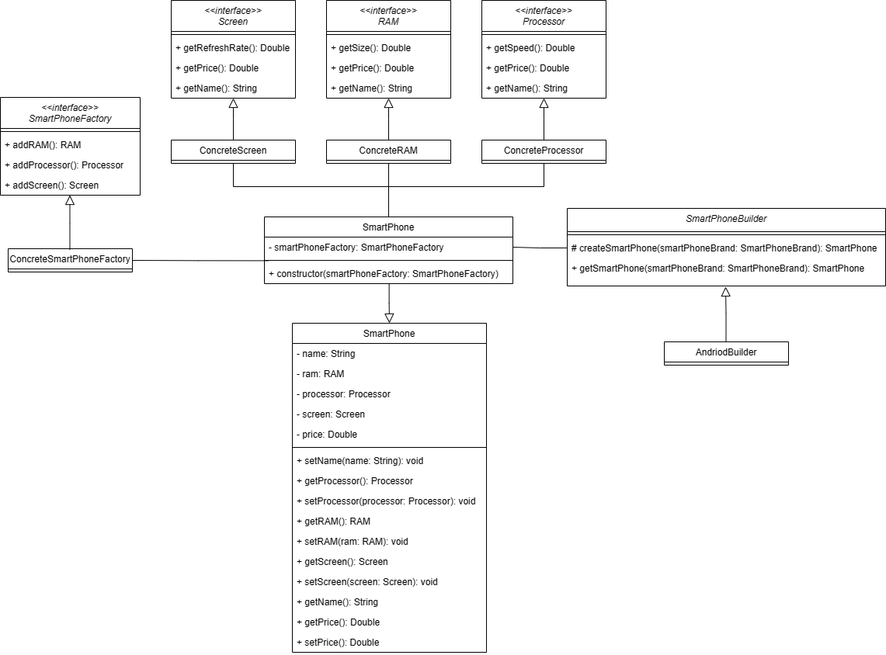
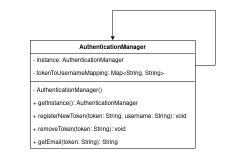

# Tutorial 4
Pada sesi `tutorial-3` kemarin, kamu sudah menerapkan dua buah *design pattern*, yaitu `Adapter` dan `Facade`. Pada sesi `tutorial-4` ini, kamu akan menerapkan *design pattern* yang sudah kamu pelajari minggu ini, yaitu `Abstract Factory` dan `Singleton`.

## Abstract Factory Pattern
Di hari Minggu yang tenang, tiba-tiba teman lamamu yang bernama David Gedegin meneleponmu. Dia merupakan seorang _reviewer smartphone_ yang sangat terkenal. David meminta kamu untuk membuatkan sebuah aplikasi sederhana untuk memudahkannya me-_review_ _smartphone_ baru. 

Permintaannya cukup sederhana. Pada awalnya, aplikasi harus menampilkan daftar merek _smartphone_ yang akan di-_review_ dalam bentuk _dropdown list_. Ketika sebuah merek dipilih dari _dropdown_, aplikasi kemudian menampilkan komponen-komponen _smartphone_ dan harga jualnya. Agar tidak terlalu rumit, David hanya ingin menampilkan 3 komponen utama saja, yaitu `RAM`, `Processor`, dan `Screen`. Selain itu, merek _smartphone_ yang ingin di-_review_ saat ini hanya ada 3, yakni `Sumsang`, `Siomi`, dan `Oddo`. 

David kemudian menjelaskan lebih rinci terkait dengan komponen dan merek _smartphone_ tersebut sebagai berikut.

### Komponen
#### 1. RAM
`RAM` merupakan memori sementara yang digunakan untuk menjalankan suatu aplikasi. Semakin besar ukuran `RAM`, semakin cepat juga suatu aplikasi berjalan. Ada 2 jenis `RAM` pada _smartphone_, yaitu:
- `SeRAM`: Memiliki ukuran **12GB** dengan harga **Rp350.000,00**
- `GeRAM`: Memiliki ukuran **8GB** dengan harga **Rp220.000,00**
#### 2. Processor
`Processor` merupakan otak dari sebuah _smartphone_ yang menjadi pengendali dari semua komponen yang ada di dalamnya. Ada 3 jenis `Processor` pada _smartphone_, yaitu:
- `SnackDragon`: Memiliki kecepatan **4.0 GHz** dengan harga **Rp500.000,00**
- `MediaPack`: Memiliki kecepatan **3.6 GHz** dengan harga **Rp380.000,00**
- `ExyYes`: Memiliki kecepatan **3.8 GHz** dengan harga **Rp420.000,00**
#### 3. Screen
`Screen` atau layar menjadi komponen utama agar bisa memvisualisasikan gambar kepada pengguna. Ada 2 jenis `Screen` pada _smartphone_, yakni:
- `Alomed`: Memiliki _refresh rate_ **120 Hz** dengan harga **Rp250.000,00**
- `Delo`: Memiliki _refresh rate_ **60 Hz** dengan harga **Rp120.000,00**

### Merek _Smartphone_
Setiap merek _smartphone_ terdiri atas kombinasi beberapa komponen. Berikut merupakan komponen-komponen yang ada pada tiga merek _smartphone_ beserta formula harga penjualannya:
|     Merek     |     RAM     |     Processor     |     Screen     |     Formula Harga Jual     |
|---------------|-------------|-------------------|----------------|----------------------------|
|    Sumsang    |    SeRAM    |       ExyYes      |     Alomed     | $(3 * harga\_processor + 3 * harga\_RAM + 1.5 * harga\_screen)$
|     Siomi     |    GeRAM    |    SnackDragon    |      Delo      | $(1.5 * harga\_processor + 2 * harga\_RAM + harga\_screen)$
|     Oddo      |    SeRAM    |     MediaPack     |      Delo      | $(2 * harga\_processor + 2 * harga\_RAM + 2 * harga\_screen)$

Karena David merupakan seorang _programmer_ juga, dia meminta kamu untuk membangun aplikasinya dengan menggunakan `abstract factory pattern`. Hal ini supaya jika nanti ada _smartphone_ baru yang dirilis, David dapat dengan mudah menambahkan _smartphone_ tersebut beserta komponen-komponennya ke dalam aplikasi.

### Requirements
- Implementasi _concrete component_ sesuai dengan detail komponen yang diberikan
- Implementasi _concrete factory_ sesuai dengan detail merek yang diberikan
- Implementasi _concrete brand smartphone_ dengan benar
- Implementasi _method_ `getSmartPhone` pada class `SmartPhoneBuilder` dengan benar
- Implementasi _method_ `createSmartPhone` pada class `AndriodBuilder` dengan benar
- Sebelum menampilkan spesifikasi, _smartphone_ harus dibuat terlebih dahulu dengan cara memasangkan komponen-komponen yang sesuai dengan brandnya
- Sistem dapat menampilkan spesifikasi _smartphone_ yang ingin dicari dengan benar

### Expected Result
- Endpoint `/smartphone` menampilkan pilihan _smartphone_ yang ingin dilihat spesifikasinya.
    

- Endpoint `/smartphone?brandInput={brand}` menampilkan spesifikasi smartphone untuk suatu _brand_.
  

### UML Diagram

## Singleton Pattern
Pada minggu sebelumnya, kamu telah menyelesaikan salah satu masalah dalam mengimplementasikan sistem autentikasi yaitu enkripsi. Namun, ada satu masalah lagi yang perlu diimplementasikan pada sistem autentikasi tersebut yaitu _cookie_. Saat ini, kamu hanya perlu membuat komponen baru untuk menambah fungsionalitas sistem autentikasi tersebut.

Pengguna dapat membuat akun dengan cara register menggunakan username dan password. Setelah akun berhasil dibuat, pengguna dapat login menggunakan username dan password tersebut. Berbeda dengan sebelumnya, pengguna akan memperoleh suatu token setelah pengguna login. Token tersebut akan disimpan sebagai _cookie_ sehingga setiap kali pengguna mengakses _endpoint_ pada aplikasi tersebut, token tersebut akan dikirimkan.

Untuk kebutuhan saat ini, _endpoint_ `/auth/authorized` hanya dapat diakses oleh pengguna yang sudah terautentikasi. Selain itu, pengguna tidak bisa login secara bersamaan menggunakan satu akun yang sama. Pengguna harus logout pada `/auth/logout` terlebih dahulu untuk dapat melakukan login di browser atau _device_ yang berbeda.

### Expected Result
- Endpoint `/auth/authorized` ketika diakses tanpa akun yang terautentikasi.
    

- Endpoint `/auth/authorized` ketika diakses dengan akun yang terautentikasi.
    

- Endpoint `/auth/login` ketika pengguna login menggunakan akun yang sama secara bersamaan.
    

Kamu perlu melengkapi kode yang sudah ada sehingga fungsionalitasnya dapat berjalan sesuai ekspektasi yang dijelaskan di atas.

### UML Diagram

